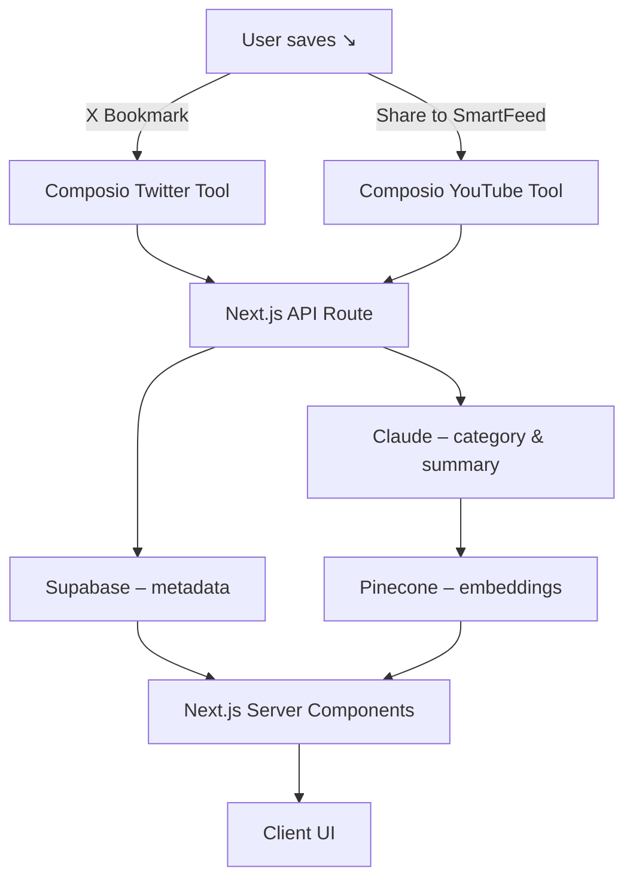

# SmartFeed – MVP PRD

## 1 • Core Problem

People save compelling **X (Twitter) posts** and **YouTube videos** but rarely return to them because the material is scattered, chronological, and lacks context. SmartFeed will surface that content in meaningful, action‑oriented feeds so users actually learn, plan, ideate, cook, or shop with it.

---

## 2 • MVP Solution

A web‑first app that automatically:

1. **Fetches** new X bookmarks and YouTube video links via an AI agent powered by **Composio**.
2. **Classifies** each item into one of five intent‑based feeds – **Learn · Plan · Ideate · Cook · Shop** – using **Claude**.
3. **Summarises** every item in ≤150 words (Claude).
4. **Indexes** all text + summaries in **Pinecone** for fast semantic search.

*No notes/collections, exports, or monetisation in MVP.*

---

## 3 • Feature Scope

| Feature                   | Detail                                                                                                                                                                                                                                                |
| ------------------------- | ----------------------------------------------------------------------------------------------------------------------------------------------------------------------------------------------------------------------------------------------------- |
| **Agent‑based Ingestion** | *Composio* handles OAuth & API calls. **X bookmarks pulled automatically on user sign‑in and whenever the user taps a "Sync" button**; YouTube links pulled when the user **shares** a video to SmartFeed (Watch Later playlist is blocked – see §6). |
| **AI Categorisation**     | Claude prompt → feed label + confidence. Manual override dropdown on each card.                                                                                                                                                                       |
| **AI Summary**            | Claude generates a 150‑word, plain‑language recap of the tweet/thread or video transcript/metadata.                                                                                                                                                   |
| **Feed UI (Next.js)**     | Tabbed layout (shadcn/ui) with card list showing icon, title, summary snippet, date, and override control.                                                                                                                                            |
| **Semantic Search**       | Search bar queries Pinecone index; returns top 20 hits <1 s (P95).                                                                                                                                                                                    |

---

## 4 • Implementation Strategy

### 4.1 Tech Stack

| Layer              | Choice                                               | Why                                                        |
| ------------------ | ---------------------------------------------------- | ---------------------------------------------------------- |
| Frontend           | **Next.js 14 (App Router)**, TypeScript, Tailwind (+ shadcn/ui)   | React Server Components, streaming summaries, and API routes.             |
| Backend            | **Next.js API Routes**                            | Server-side processing with edge runtime for async tasks.                |
| Database           | **Supabase (PostgreSQL)**                         | Real-time subscriptions, built-in auth, and vector similarity search. |
| LLM                | **Anthropic Claude**                                 | 200 k‑token context window for long threads & transcripts. |
| Agent/Integrations | **Composio**                                         | 3 000+ tools; abstracts auth; supports Anthropic natively. |
| Vector DB          | **Pinecone**                                         | Millisecond similarity search; managed.                    |
| Hosting            | **Vercel** (Next.js app with edge functions). |                                                            |

### 4.2 Data Flow

### 4.3 Key Prompts

1. **Categorise Prompt** – map content → 5 feeds; include `confidence` JSON key.
2. **Summary Prompt** – "Summarise in ≤150 words…"; return `bullets` + `tl;dr`.

---

## 5 • Functional Requirements

| ID       | Requirement                                                                                                      |
| -------- | ---------------------------------------------------------------------------------------------------------------- |
| **FR‑1** | Composio agent ingests new X bookmarks **immediately upon user sign‑in and when the user taps the Sync button**. |
| **FR‑2** | User‑shared YouTube links are ingested instantly (<5 s).                                                         |
| **FR‑3** | ≥90 % correct feed classification (internal validation).                                                         |
| **FR‑4** | Summaries generated ≤10 s after ingestion.                                                                       |
| **FR‑5** | Semantic search returns top 20 results <1 s (P95).                                                               |
| **FR‑6** | Manual override persists in <200 ms and updates Pinecone.                                                        |

---

## 6 • Integration Blockers & Mitigations

| Area                      | Blocker                                                                                                                                                  | Impact                                 | Mitigation                                                                                                                                        |
| ------------------------- | -------------------------------------------------------------------------------------------------------------------------------------------------------- | -------------------------------------- | ------------------------------------------------------------------------------------------------------------------------------------------------- |
| **X Bookmarks API**       | Bookmarks endpoints require *Manage Bookmarks* scope and are only available on paid tiers; Composio's Twitter tool may not yet expose the new endpoints. | Cannot fetch bookmarks via agent.      | Verify Composio spec; if missing, create custom Composio tool referencing `GET /users/:id/bookmarks` and ensure elevated access or proxy raw API. |
| **Rate Limits**           | X Bookmarks endpoint: 1 000 req/user/24 h (standard), higher on Enterprise.                                                                              | Large imports may throttle.            | Pull on sign‑in and Sync reduces background polling; use incremental sync with `since_id`; queue requests; exponential backoff.                   |
| **YouTube Watch Later**   | Google removed API access to `WL` playlist (errors `watchLaterNotAccessible`) – official docs confirm.                                                   | Cannot auto‑pull Watch Later playlist. | Switch to "Share to SmartFeed" workflow (mobile share‑sheet & browser extension) or ingest **Liked Videos** (publicly accessible) instead.        |
| **Composio YouTube Tool** | Current tool covers search & video CRUD but not share‑sheet triggers.                                                                                    | Manual share might skip agent.         | Implement Composio custom trigger that receives webhook from share‑sheet or Chrome extension.                                                     |

---

## 7 • Non‑Functional Requirements

- **Security** – OAuth 2.0; encrypted at rest/in transit; least‑privileged scopes.
- **Reliability** – 99.5 % API uptime; ingestion retries w/ backoff.
- **Scalability** – 10 k items/user; stateless services; horizontal scale.
- **Accessibility** – WCAG AA; keyboard nav; aria‑labels.

---

## 8 • Milestones (6‑Week MVP)

| Phase                           | Duration | Deliverables                                                                |
| ------------------------------- | -------- | --------------------------------------------------------------------------- |
| **Week 1 – PoC**                | 1 wk     | Composio auth; pull sample X bookmark; Claude summary; Pinecone insert.     |
| **Week 2 – Backend Core**       | 1 wk     | Next.js API routes; Supabase setup; sign‑in ingestion; Sync endpoint; YouTube share endpoint. |
| **Week 3 – Frontend Alpha**     | 1 wk     | Next.js App Router; tabs; card list; Sync button; override control.                     |
| **Week 4 – Search & Summaries** | 1 wk     | Search API; streaming UI; accessibility pass.                               |
| **Week 5 – Private Alpha**      | 1 wk     | 20 users; log metrics; fix bugs.                                            |
| **Week 6 – Waitlist Beta**      | 1 wk     | 100 users; success metrics; decision for Phase 2.                           |

---

## 9 • Open Questions

1. Should we prioritise **Liked Videos** playlist as automatic YouTube source instead of share‑sheet?
2. Is Composio able to expose new X Bookmarks endpoints under current SLA, or do we need a custom wrapper?
3. Pre‑compute embeddings or on‑demand chunking for videos >20 minutes?
4. Should we leverage Supabase's built-in vector similarity search instead of Pinecone for cost optimization?

